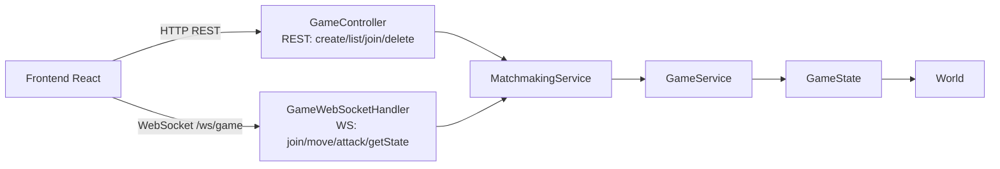

# ServicioWeb - Juego Distribuido con API REST + WebSocket

## 📋 Descripción

Este módulo implementa una versión web del juego distribuido usando una arquitectura **híbrida**:

- **API REST** para operaciones de lobby y matchmaking (crear, listar, unirse, eliminar partidas).
- **WebSocket (WS)** para comunicación en tiempo real del estado del juego (movimiento, combate, broadcast del tablero).

El objetivo es separar claramente:

- Control de sesión de partidas por HTTP (request/response)
- Simulación en tiempo real por canal persistente WS

## 🛠️ Tecnologías

- Java 17+
- Spring Boot 4
- Spring Web (REST)
- Spring WebSocket
- Maven
- Frontend React + Vite + Tailwind (en `frontend/`)

## 🏗️ Arquitectura General



## 📡 API REST

La API REST se usa para operaciones de matchmaking y ciclo de vida de partidas:

| Método | Endpoint | Descripción |
|--------|----------|-------------|
| `GET` | `/api/games/health` | Verificación de estado |
| `POST` | `/api/games/create` | Crear partida |
| `GET` | `/api/games` | Listar partidas |
| `POST` | `/api/games/{port}/join` | Unirse a partida |
| `DELETE` | `/api/games/{port}` | Eliminar partida |

### 📂 Implementación en código

- Controlador REST: `src/main/java/backend/controller/GameController.java`
- Lógica de matchmaking: `src/main/java/backend/service/MatchmakingService.java`
- DTOs REST: `src/main/java/backend/dto/`

### 🌐 Uso desde frontend

- Llamadas `fetch(...)` para crear/listar/unirse:
  - `frontend/src/App.jsx`

## 🔌 WebSocket (WS)

El canal WS se usa para comandos en tiempo real y sincronización de estado.

### Endpoint WS

- `ws://localhost:8080/ws/game`

### Registro del endpoint

- Configuración WS: `src/main/java/backend/config/WebSocketConfig.java`

### Handler principal

- `src/main/java/backend/config/GameWebSocketHandler.java`

### Mensajes entrantes (cliente → servidor)

| Comando | Descripción |
|---------|-------------|
| `join` | Vincula sesión WS con partida/jugador |
| `move` | Movimiento con WASD |
| `attack` | Ataque a enemigo adyacente (o objetivo seleccionado) |
| `getState` | Solicita snapshot actual |

### Mensajes salientes (servidor → cliente)

| Comando | Descripción |
|---------|-------------|
| `joined` | Confirmación de unión |
| `gameState` | Estado completo (mapa, jugadores, enemigos) |
| `combatResult` | Resultado de intercambio de combate |
| `error` | Errores de validación/comando |

### 🌐 Uso desde frontend

- Conexión WS y manejo de eventos:
  - `frontend/src/App.jsx`

## 🔄 Flujo Funcional REST + WS

1. El usuario crea o selecciona partida por REST.
2. El frontend abre WS y envía `join` con `port` + `playerName`.
3. El servidor responde `joined` y hace `broadcast` de `gameState`.
4. Las acciones de juego (`move`, `attack`) viajan por WS.
5. Cada acción actualiza `GameState` y se reenvía a todos los clientes de la misma partida.

## 📦 Estructura del Proyecto

```text
ServicioWeb/
├── src/main/java/backend/
│   ├── controller/
│   │   └── GameController.java          # API REST
│   ├── config/
│   │   ├── WebSocketConfig.java         # Registro endpoint WS
│   │   └── GameWebSocketHandler.java    # Mensajería en tiempo real
│   ├── service/
│   │   ├── MatchmakingService.java      # Matchmaking (REST)
│   │   └── GameService.java             # Estado por partida
│   ├── core/
│   │   └── GameState.java
│   ├── world/
│   │   └── World.java
│   ├── entities/
│   │   └── Player.java
│   └── combat/
│       └── Enemy.java
├── src/main/resources/
│   ├── application.properties
│   └── static/                          # cliente HTML básico (legacy)
└── frontend/                            # cliente React actual
    └── src/App.jsx
```

## 🚀 Instalación y Ejecución

### Requisitos Previos

- Java 17 o superior
- Maven 3.6 o superior
- Node.js 18+ (para el frontend)
- npm

### Paso 1: Backend (Spring Boot)

Desde `ServicioWeb/`:

```bash
mvn spring-boot:run
```

Backend local: `http://localhost:8080`

### Paso 2: Frontend React

Desde `ServicioWeb/frontend/`:

```bash
npm install
npm run dev
```

Frontend local: `http://localhost:5173`

## ✅ Verificación Rápida

| Prueba | Endpoint |
|--------|----------|
| Health REST | `GET http://localhost:8080/api/games/health` |
| WebSocket | `ws://localhost:8080/ws/game` |

Si la app web carga partidas por REST y actualiza tablero/combate en tiempo real, la integración REST + WS está correcta.

## 💡 Notas de Diseño

- **REST** se usa para operaciones idempotentes o de administración de partida.
- **WS** se usa para eventos de alta frecuencia y baja latencia.
- Esta separación reduce polling HTTP y mantiene una interfaz web reactiva en tiempo real.

## ✍️ Autor

Velazquez Parral Saul Asaph

## 📚 Repositorio

https://github.com/Asaph-Velazquez/Sistemas-Distribuidos.git
